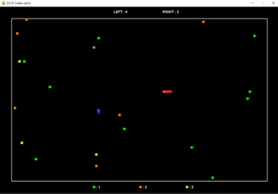
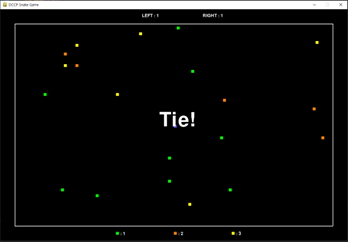
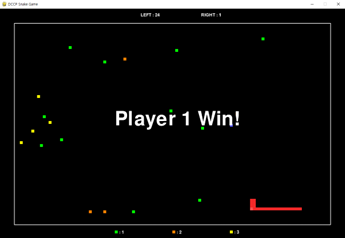
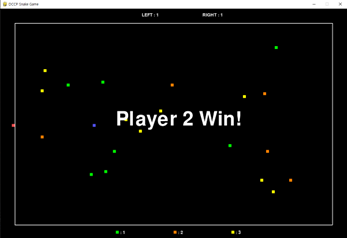

# SnakeGame
2021년 2학기에 서울대 후배 과제를 도와주면서 제작한 2인용 snakegame
## Play

## Rule
1. 플레이어 P1과 P2는 각각 화면의 왼쪽과 오른쪽에 위치한 뱀을 조작해서 상하좌우로 움직일 수 있다. 
	- 플레이어 P1 : Turn (W, A, S, D) 
	- 플레이어 P2 : Turn(Arrow Keys ↑, ←, ↓, ↑)
2. 게임은 다음 조건에 따라 승패가 결정됩니다. 다음 경우에 게임에서 지게된다.
	- 뱀이 벽에 닿을 경우 
	- 상대 플레이어의 몸에 부딪히는 경우
3. 게임 시작 시 일정한 개수의 먹이를 임의의 위치에 생성시킨다. 
4. 뱀을 조작해서 먹이를 먹으면 색에 따라 몸통이 길이가 길어지고, 먹이 1개가 임의의 위치에 추가로 생성된다.
## Goals
1. 움직일 수 있는 플레이어(snake)와 먹을 수 있는 먹이가 있어야 한다.
    - 게임을 시작하면 두 명의 플레이어가 있어야 한다. 플레이어는 맨 처음에는 멈춰있다. 이후 첫 번째 플레이어는 방향키(↑↓←→),   두 번째 플레이어는 W, S, A, D를 통해 일반적인 snake game과 동일한 조작을 할 수 있어야 한다. 
    - 두 플레이어는 서로 독립적이다. 예를 들어 P1의 길이가 길어져도, P2의 길이는 유지되어야 한다.
    - 게임을 시작하면 20개의 먹이가 있다. 플레이어가 먹이의 위치로 가면 먹이가 사라져야 한다. 
    - 플레이어와 먹이는 색을 통해 구분되어야 한다. 
    - 최소 가로 80, 세로 40개 이상의 타일이 있어야 한다. 각 타일의 크기는 10 이상이어야 한다.   플레이어는 1초에 5개 이상 10개 이하의 타일을 움직일 수 있어야 한다. 
    - 두 플레이어 뱀의 먹이의 색, P1의 머리와 몸통의 색, P2의 머리와 몸통의 색은 모두 달라야 한다.
2. 플레이어가 먹이를 먹으면 먹이가 사라지고 랜덤한 색상의 먹이가 생성되어야 한다. 
    - 플레이어가 먹이를 먹으면 해당 먹이는 사라지고 게임 내 임의의 위치에 새로운 먹이가 생성되어야 	한다. 
        - 생성되는 먹이끼리는 위치가 겹치면 안된다.
		- 생성되는 먹이는 뱀의 머리/몸체와 겹치면 안된다. 
	- 게임 내 총 먹이의 수는 계속 같게 유지된다. 
	- 먹이는 3개의 색상이며 랜덤하게 생성된다. 
		- 마찬가지로 먹이와 뱀의 색은 구별되어야 한다. 
3. 플레이어가 먹이를 먹을 때마다 먹이에 따라 몸통의 길이가 X칸씩 길어져야 한다. 
	- 먹이를 먹을 때마다 뱀의 길이가 먹이의 색에 따라 N(1~3)씩 늘어난다.
	- 뱀의 머리와 몸통은 색을 통해 구분되어야 한다.
	- 특정 시간(5초~10초)마다 뱀의 크기는 1씩 줄어들고, 길이가 1일때는 줄어들지 않는다.
		- 뱀의 기본 길이는 1이다.
	- 게임에 대한 정보와 뱀이 돌아다니는 게임이 구분되어 표현되어야 한다. 
		- 화면 구분은 상하좌우 여백과 플레이어가 돌아다닐 수 있는 게임화면으로 구성된다. 
		- 여백과 게임화면은 흰색 사각형으로 구분된다. 
		- 플레이어는 흰색 사각형에서 나가는 순간 게임이 종료된다. 
		- 게임화면의 하단에 범례가 추가 된다. 먹이에 따라 늘어나는 길이가 적혀있어야 한다.
		- 게임의 상단에는 뱀의 길이에 대한 정보가 텍스트로 주어져야 한다. 
4. 게임종료 조건에 대해 구현한다. 
	- 플레이어가 화면 바깥으로 나가면 즉시 게임이 종료되어야 한다
	- 다음 조건 중 하나 이상이 만족하면 게임이 종료됩니다.
		- 특정 길이(24)에 도달하는 플레이어가 승리 (24이상) 
		- 벽에 부딪히면 해당 플레이어 패배 
		- 상대 뱀의 몸에 부딪히면 해당 플레이어 패배 
		- 두 뱀의 머리가 만나면 길이가 짧은 플레이어가 승리 
	- 먹이는 벽에 붙어있으면 안된다. (벽과 최소 1칸이상 떨어져있어야 함) 
	- 종료에 따라 P1 win, P2 win을 출력 
	- 게임이 종료되면 승리 플레이어가 게임화면에 출력된다. (P1 Win 또는 P2 Win)
	- 종료조건이 동시에 진행되는 경우 “Tie” 출력 
		- 동시에 벽에 부딪히는 경우 
		- 같은 길이에서 머리가 만나는 경우 
		- 하나가 벽에 부딪히고, 하나는 몸에 부딪히는 경우 
		- 등등 
<<<<<<< HEAD
=======
## Play

>>>>>>> 0734794a501d86dfed0816915b370f90ac4e6d6c
